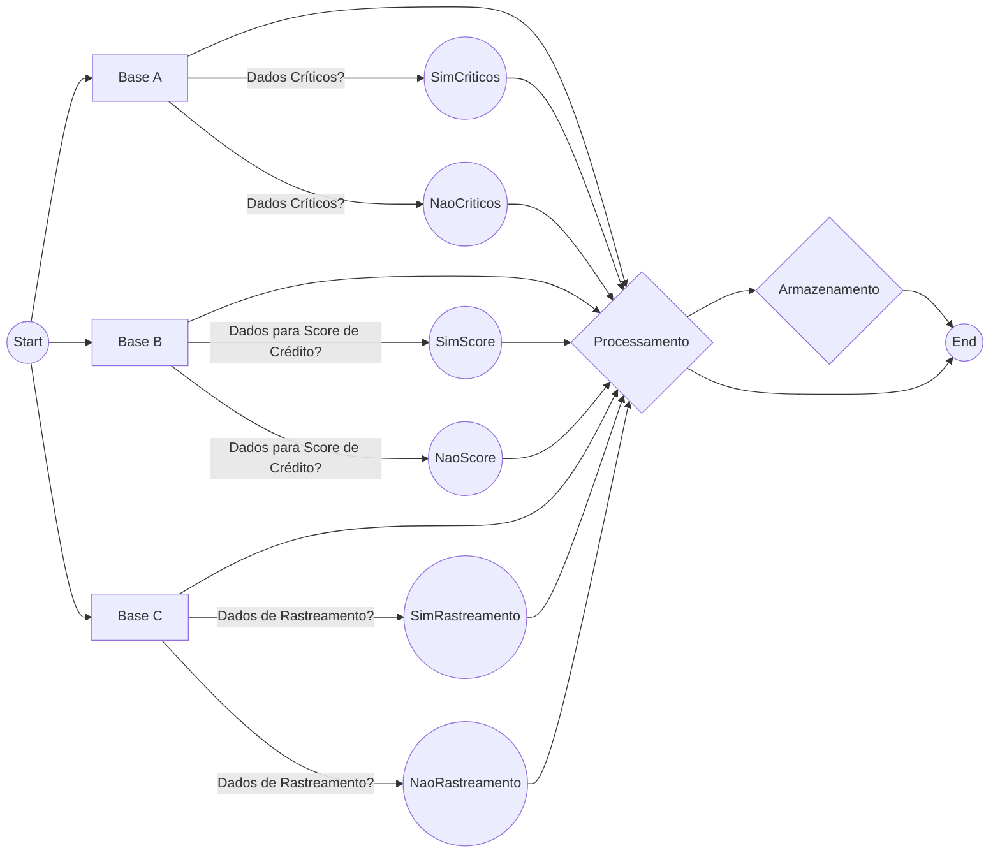

A solução proposta é a seguinte:

## 1. Armazenamento:

- Base A: Para a Base A, que contém dados extremamente sensíveis, sugiro utilizar um sistema de armazenamento altamente seguro e com acesso de baixa performance. Uma opção seria o uso de um banco de dados criptografado e com controle de acesso rigoroso, como o PostgreSQL com suporte a criptografia de dados em repouso. Outra opção seria manter tudo com os serviços cloud da AWS, usando o Amazon RDS (Relational Database Service) com instâncias do Amazon Aurora que tem plena compatibilidade com o PostgreSQL.

- Base B: Para a Base B, que possui dados críticos e precisa de um acesso mais rápido, sugiro o uso de um banco de dados de alto desempenho e escalabilidade, como o MongoDB. Além disso, pode ser necessário ter um cluster de servidores para suportar consultas e extração de dados por meio de algoritmos de aprendizado de máquina.

- Base C: Para a Base C, que não possui dados críticos, mas requer acesso extremamente rápido, pode ser usado um banco de dados em memória, como o Redis. Isso permitirá um acesso rápido aos dados, adequado para a funcionalidade de rastreamento de eventos relacionados a um CPF.

## 2. Tecnologias adotadas:

- Banco de Dados: PostgreSQL criptografado, ou Amazon RDS/Aurora para a Base A, MongoDB para a Base B e Redis para a Base C.

- Linguagem de Programação: Uma linguagem de programação adequada para desenvolver os sistemas de micro-serviços, como Java, Python ou Node.js.

- Frameworks: Utilização de frameworks como Spring Boot (Java), Flask (Python) ou Express.js (Node.js) para facilitar o desenvolvimento dos serviços.

- Infraestrutura: Uso de serviços de nuvem, como AWS (Amazon Web Services), para garantir escalabilidade, disponibilidade e segurança dos sistemas.

## 3. Arquitetura utilizada:

- Micro-serviços: Implementação da arquitetura de micro-serviços, que permite a modularidade e flexibilidade do sistema, facilitando a manutenção e evolução dos serviços individualmente. Cada serviço seria responsável por acessar e consumir os dados específicos de cada base.

## 4. Dados armazenados:

- Base A: CPF, Nome, Endereço, Lista de dívidas.

- Base B: CPF, Idade, Lista de bens, Endereço, Fonte de renda.

- Base C: CPF, última consulta do CPF em um Bureau de crédito, Movimentação financeira nesse CPF, Dados relacionados à última compra com cartão de crédito vinculado ao CPF.

## 5. Disponibilização dos dados:

- API RESTful: Criação de APIs RESTful para disponibilizar os dados aos interessados. Cada serviço (micro-serviço ou nano-serviço) teria sua própria API para acessar os dados específicos da base de dados que ele consome, desenvolvidas com o Spring MVC e implantadas utilizando o Amazon API Gateway.

- Autenticação e Autorização: Implementação de um sistema de autenticação e autorização robusto para controlar o acesso aos dados sensíveis.

## Diagrama UML

